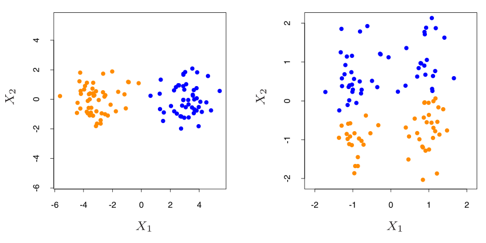

"The Elements of Statistical Learning" (2nd edition) by Trevor Hastie, Robert Tibshirani, and Jerome Friedman --- Chapter 14.3.

---

# Chapter 14 Intro

Unsupervised learning: "learning without a teacher"

You have $N$ observations $(x_1, x_2, ..., x_N)$ of a random p-vector $X$ having joing density $Pr(X)$.

You goal is to directly infer the properties of this probability density *without* help from a teacher who tells you how right you are.

Good news is that $X$ represents all the variables; don't have to figure out how $Pr(X)$ changes in response to some hidden variable.

Bad news is that our nice, neat, non-parametric methods for doing this fail when $X$ is high dimension.

A number of techniques therefore try to identify low-dimensional manifolds within this space that are still able to represent rich data. Sometimes we can re-express the high-dimension space as functions of a lower dimension space of "latent variables"

*A Silly Example?: Population density maps are spacially 2d even though technically people's locations vary across 3 spacial dimensions. That third spacial dimension just doesn't really matter much for understanding where people live.*

Because there's no teacher to tell us how right or wrong we are, these methods depend on heuristic evaluations of quality.

# 14.2: Cluster Analysis

Also called data segmentation.

Segment a set of objects/data-points into **clusters** such that two points within a cluster are more similar than points from two different clusters.

Sometimes the clusters form a hierarchy. (*Hey, isn't that basically what pre-genetic taxonomists were trying to do?*)

Clustering methods are distinguished by how they define the **similarity** between two points.

## Proximity Matrix

Sometimes we are directly given the (dis)similarities between points. Not the same as distances because triangle inequality doesn't need to hold.

$N\times N$ matrix $D$, where $N$ is number of objects, and $d_{ij}$ is the **proximity** between the $i$th and $j$th objects.

Typical to presume 
all $d_{ii} = 0$, 
all $d_{ij} \geq 0$, 
and symetric $D$.

### Converting from Measured Attributes to Proximity Matrix

Each data-point is a list of $P$ different attributes. (ex: height, weight, shoe size, ...)

If $x_{ip}$ is the $p$th attribute of the $i$th data-point, then we construct $D$ by

$$D_{ij} \equiv \sum_{p=1}^{P} w_p \cdot d_p (x_{ip},x_{jp}) $$

Where $w_p$ is the weight placed on attribute $p$ and $d_p()$ is the dissimilarity function for attribute $p$.

> Although simple generic prescriptions for choosing the individual attribute dissimilarities and their weights can be comforting,
there is no substitute for careful thought in the context of each individual problem. Specifying an appropriate dissimilarity measure is far more
important in obtaining success with clustering than choice of clustering
algorithm. 

Most common is  squared distance:

$$d_p (x_{ip},x_{jp}) \equiv (x_{ip} - x_{jp})^2$$

<!--Other options include 

- absolute error  
$$| x_{ik} - x_{jk} |$$
- coorelation  
$$ \frac{\sum_k (x_{ik}-\bar{x_i})(x_{jk}-\bar{x_j})}{\sqrt{\sum_k (x_{ik}-\bar{x_i})^2(x_{jk}-\bar{x_j})^2}} $$-->

For ordinal attributes, like grades or poll responses, replace the $m$th option with $\frac{m-\frac{1}{2}}{M}$ before plugging into the above.

For unordered categorical attributes, *like eye color*, $d_p$ needs to be explicitly pairwise defined.

The relative importance of an attribute is proportional to its average dissimilarity across points. For squared distance, this means proportional to variance.

To make all attributes equally important, set $w_p = \bar{d_p}$. But this isn't always a good idea. *If you had a dataset of people with (height, number fingers, number toes, number eyes, number nostrils, etc.), then increasing the importance of all those attributes with very little variation would obscure the sex-induced bimodality of height.*  

If a data-point has missing attributes, you could:

- set $d_p (x_{ip},x_{jp})$ to zero
- impute the missing values using the average of that attribute
- include "missing" as just another categorical value

## Clustering Algorithms

### Combinatorial Algorithms

In Combinatorial Algorithms, 
each data-point is assigned to one of a
prespecified number of clusters $K$.

Encoder $k=C(i)$ maps $i$th point to $k$th cluster. You want to find the best encoder $C^* (i)$.

One approach is to minimize a loss function like the so-called within cluster point scatter:

$$W(C)=\frac{1}{2}\sum_{k=1}^K \sum_{i\in C^{-1}[k]} \sum_{j\in C^{-1}[k]} D_{ij}$$

Similarly, between-cluster scatter is 

$$B(C)=\frac{1}{2}\sum_{k=1}^K \sum_{i\in C^{-1}[k]} \sum_{j\notin C^{-1}[k]} D_{ij}$$

Total scatter $T\equiv\frac{1}{2}\sum_i\sum_j D_{ij}=W(C)+B(C)$ is constant, so minimizing $W(C)$ same as maximizing $B(C)$.  

We can't enumerate all the possible mappings, and iterative greedy descent can get stuck in suboptimal local optima.

#### K-means Clustering

Uses squared euclidean distance as dissimilarity metric:

$$D_{ij} = \sum_p (x_{ip}-x_{jp})^2$$

1. Start with a guess for the center positions of $K$ clusters.
2. Repeat until convergence:
     1. (Re)asign each data-point to the cluster with the closest (squared Euclidean distance) center
     2. Replace each cluster's center position with the coordinate-wise average of all the data-points in that cluster. 

In other words, split space into Voronoi cells, find the centroids of each cell's data-points, and use those centroids as seeds for new vornoi cells.

$K$ is chosen before algorithm starts. Changing $K$ can lead to arbitrary changes in cluster memberships.

#### Vector Quantization

Use K-means clustering for image compression: 

1. Split the image into small blocks, which each (sub)pixel an attribute. 
2. Do K-means clustering
3. Replace each block with its cluster's centroid (called its **codeword**)

Further related reading [1](https://en.wikipedia.org/wiki/Shannon%27s_source_coding_theorem)
[2](https://www.amazon.com/Quantization-Compression-Springer-International-Engineering/dp/0792391810)

#### K-medoids

K-means clustering depends on squared Euc distance for assigning points to clusters. 

It can be generalized to arbitrary $D$ by 

- Restricting the choice of centroid to be one of the data points in the cluster.
- Reassigning points by choosing $k$ to explicitly minimize the value of $D_{im_k}$

Second step same computational intensity, first step more intensity than K-means. 

#### Indentifying "natural" clusters.

Minimize $W(C)$ for each $K < K_{max}$. Splitting apart a natural cluster will decrease $W$ less than splitting multiple clumps incorrectly treated as a single cluster. The kink in $W_k$ shows the "natural" number of clusters. This is pretty heuristicy though.

#### Hierarchical Clustering

Clusters at each level of the heirarchy are created by merging clusters at the next lower level.

**Agglomerative Clustering** starts with $N$ single-object clusters. At each stage, it merges the 2 clusters with the smallest inter-group dissimilarity.

Single Linkage AC means that intergroup dissimilarity is that of the least dissimilar pair. (Nearest-neighbor)

Complete linkage uses furthest neighbors.

Group average uses average dissimilarity between groups.

**Divisive Clustering** starts with one cluster. Each stage splits a group to produce two new groups with large dissimilarity.

You can split the groups using K-means/medoids (but would depend on starting centroids) or by putting all the points in one group, setting aside the one with the most average dissimilarity from the rest, and shuffling points over into the second group.

You can choose which cluster to split by looking at largest diameter or average dissimilarity.

*Dendrograms are pretty. If you build a dendrogram from species, how well does it match actual tree of life?*

