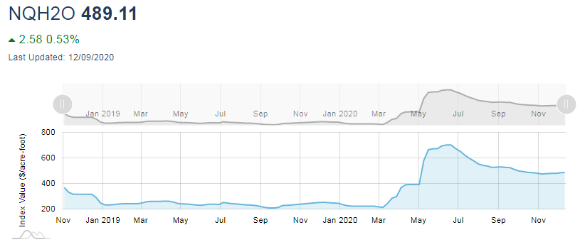
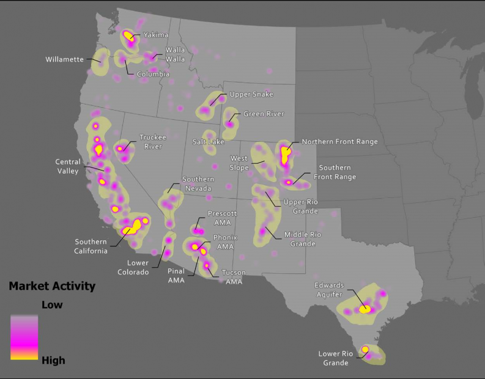
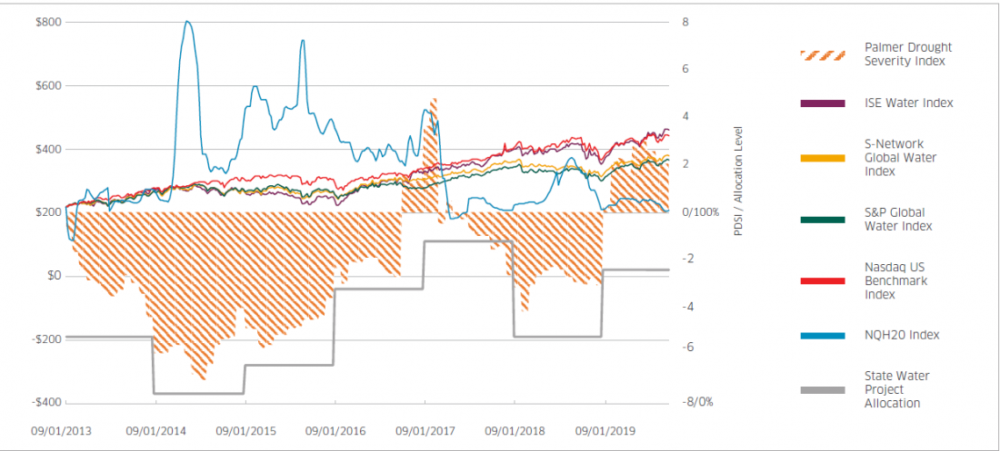

# Water Futures and Californian Water Markets

## The New Water Futures

[News article 1](https://www.bloomberg.com/news/articles/2020-12-06/water-futures-to-start-trading-amid-growing-fears-of-scarcity)

Water futures introduced in September as a hedge for big water consumers (almonds and electricity)

- CME Group has Futures contract for for California water.
- January 2021 contract priced at $496 per acre-foot (now 538?)
- California has a 1.1 billion dollar spot market for water (details?)
- Futures are tied to [Nasdaq Veles California Water Index](https://www.cmegroup.com/education/courses/understanding-the-nasdaq-veles-california-water-index.html) 
  - "water rights in California, underpinned by the volume-weighted average of the transaction prices in the state’s five largest and most actively traded markets"
- Each contract for 10-acre feet (3.26 million gallons) and financially settled.
- Contract seemed low volume as of the time of the article's writing.

[Barton Thompson](https://law.stanford.edu/directory/barton-thompson/) says:
> I don’t think the futures contract itself is really changing the water markets... Nor is it changing the risk that exists out there that water in the future at some point will be in shorter supply, it’s simply responding to those things.

### Details of the contract

See [this page](https://www.cmegroup.com/trading/equity-index/us-index/nasdaq-veles-california-water-index_contract_specifications.html) from CME group

Oh, cool. There's a volume tab. Yeah, looks like only a couple dozen transactions so far.

And [here's a FAQ](https://www.cmegroup.com/education/articles-and-reports/nasdaq-veles-california-water-index-futures-faq.html)

### Article from CME with justification

[This article](https://www.cmegroup.com/openmarkets/commodities/2020/californias-complex-water-market-faces-new-challenges.html) contains some interesting info about Cali's water markets

Big problem: California gets its water in the north during winter, but uses it in the south during summer. And climate change makes things even swingier.

- Cali gets 75 million acrefeet of useable rain water per year
  - Most of it comes in winter, or from melting snow in the spring
- Most surface water is in north, groundwater evenly spread out
  - [Bill passed](https://water.ca.gov/Programs/Groundwater-Management/SGMA-Groundwater-Management) after 2014 drought to try to encourage sustainable groundwater use
- 40% of water is environmental (don't dam every river), 40% agriculture, 10% urban
  - 9 million acres of irrigated farm in california, which required 24.5 million acrefeet of water in 2018
    - USDA conducts agriculture census. [Here are some results](https://www.nass.usda.gov/Publications/Highlights/2019/2017Census_Irrigation_and_WaterManagement.pdf) from the 2017? 2018? census.
      - Cali used 24.5 acrefeet of water, about 30% of US total. 
      - Cali uses double the average amount of irrigation water per acre. Throughout US, farmland uses 1.5 feet of water, but Cali uses 2.9 feet. (Not as bad as Arizona though, which uses 4.7 feet)
      - Nebraska only uses 0.6 feet. Is nebraska using resources more productively, or is it just that Nebraska doesn't need to use *irrigation* as much? (Rain?) The water sources include "on-farm surface water", so I would guess that Nebraska really does use less water.
    - Cali has seen growth in tree and vine crops which need be watered year to yar and makes state more vulnerable to water shortages. Drat! It turns out nuts have a dark side!
    - In urban use, half! is use for landscape watering?!
      - Oh, good news. While total urban water use has gone up, per capita urban water use has decrease from 231 gallons per day in 1990 to 146 in 2015. (But if that's 10% of water use, that means over a 1000 gallons per day, consistent with notes below) [Most savings came from reduced watering.](https://www.ppic.org/publication/water-use-in-california/). 
      - boo grass!
- Rising temps mean less snowpack, which means less water. If 50% less snowpack, and snowpack 30% of water, then rising temps could lead to 15% loss of california water. Oh noes
-  Plus rising temps directly means crops will need more water

## The Water Index

[This website](https://www.cmegroup.com/education/courses/understanding-the-nasdaq-veles-california-water-index.html) has some nifty facts, but annoyingly links to the *home webpage* of the organizations for their sources. Gah! I wanted a link to the source of the fact that US uses 322 billion gallons of water per day, not just a link to the USGS homepage!!!

### Sidenote: Water usage

Taking that 322 bil per day as accurate, that means US uses 

$$\frac{waterUse}{population} = \frac{322,000,000,000}{308,401,808} \approx 1044$$

gallons of water per day per person. Mayoclinic [says](https://www.mayoclinic.org/healthy-lifestyle/nutrition-and-healthy-eating/in-depth/water/art-20044256) average healthy adult in temperate climate needs less than a gallon per day.  So only a tiny fraction of my water is going into my belly.

[This kids activity](https://water.usgs.gov/edu/activity-percapita.php) from the USGS lists the water usage of various activities. Showering uses up to 5 gallons per minute, dish and clothes washing uses a bunch. Plugging in the daily activities of a heavy water-user, it's hard to get it above 200 gallons per day. So back of napkin math suggests something like 80% of water usage comes from intermediate goods rather than direct consumption. Lawns are probably a big factor too, though. There's probably a good source out there where someone has already broken it down. TODO

### Facts about the index

Above link has some details, as does [this page](https://www.waterexchange.com/ca-water-index/) 

-Volume weighted index from several different water spot markets
  - California’s surface water market
  - Central Basin
  - Chino Basin
  - Main San Gabriel Basin
  - The Mojave Basin
-Launched in 2018. Published weekly.
-Adjusts for things like water loss. Priced per acre-foot
-"All purchase and sales agreements are overseen by a government entity" Which one?
- uses [WestWater’s Waterlitix database](https://www.waterexchange.com/waterlitix/) for transaction data
- Crazy how much the index shot up this summer.

[This press release](https://www.nasdaq.com/solutions/nasdaq-veles-water-index) has some nifty picturse (where do the pictures come from? Is there a publically accessible paper from Westwater that I'm missing?)

#### Comparison to other water indices.

For comparison, the press release shows this graph of several other water indices:
- Palmer Drought Severity Index uses weather data to estimate long-term soil dryness. Normal levels are 0, while negative levels indicate dryer than average soil.
  - [Here's a page](https://www.ncdc.noaa.gov/temp-and-precip/drought/historical-palmers/)from the NOAA with a fun animated historical map. [Description of index](https://www.ncdc.noaa.gov/temp-and-precip/drought/historical-palmers/overview) link for description and sources.
  - Now here's a good url: [drought.gov](https://www.drought.gov/drought/data-maps-tools/current-conditions)
- [ISE Water Index](https://etfdb.com/etf/FIW/#holdings), [S-Net GWI](https://snetworkglobalindexes.com/indexes/s-network-global-water-indexes/data/constituentdata/jgi), [S&P GWI](https://etfdb.com/etf/CGW/#holdings), are all indexes that measure the performance of water-related companies. 
  - For example, the S-Net index mostly consists mostly of water utilities and water-related industrial companies. But they assing the most weight (10% of the index!) to Ecolab Inc, a Saint Paul based firm which supplies chemicals for water treatment, [among other things](https://www.ecolab.com/offerings).
- NQH20 is the index which the above futures contract is based on. California water
- The State Water Project Allocation shows water supplied by the [California State Water Project](https://en.wikipedia.org/wiki/California_State_Water_Project) (SWP). The SWP promises to supply a certain amount of water to its contractors, but has been unable to fulfill the entirety of those contractors' needs for quite some time. See below. 

### Interesting links from Westwater

Minor distraction: Waestwater has [list of "Insights"](https://www.waterexchange.com/insights/) on the webpage for their water price index. Some neat stuff:

- [Map of revenue per acre-foot of water](https://www.waterexchange.com/insights/). SoCal has high-value orchards. But doesn't that still seem wasteful. Shouldn't the orchards be in places with actual rivers and not scorching droughts. Grow the almonds in nebraska and Cali can grow gene-modded drought-resistant wheat or something cool like that?
- [Seems like Colorado might have a similar problem to Cali](https://bizwest.com/2020/10/23/confluence-with-agricultural-water-available-is-noco-the-next-source-for-thirsty-cities/?utm_source=ActiveCampaign&utm_medium=email&utm_content=BizWest+Daily%3A+Tense+Estes+Park+works+to+aid+fire+crews&utm_campaign=2020+10+23+BizWest+Daily+-+Ad+Boulder+Chamber), needing to pump water from the north down to their cities
- There are apparently such things as [water podcasts](https://www.clydesnow.com/category/media/podcasts/). Confusingly, Ripple Effect is also the name of much more popular history podcast.
- Washington is [also having water troubles](https://www.seattletimes.com/seattle-news/gov-inslee-declares-drought-for-about-half-of-washington-state/) because of less snowpack.

Answered a question I had about climate change. Most of what I've read says that climate change will tend to cause more extreme precipitation events than droughts. So why all the water realted concerns wrt climate change? Because hot means less buildup of snow on mountain tops, and we use that meltwater. So even if more rain, less water will be in rivers.

## Sidenote: the California State Water Project

### Wow, this stuff is a feat of engineering.

[Here's a map of california water infrastructure.](https://en.wikipedia.org/wiki/Sacramento%E2%80%93San_Joaquin_River_Delta#/media/File:Water_in_California_new.png)

SWP is one of the largest water suppliers in the world, and the largest single consumer of power in California. It's a massive engineering project. They collect water from northern california, and pump it to cities and farms in the south. SUpplies water to the majority of californians. 

Surpringly, 70% of the water is going to urban areas. Presumably mostly industrial. And I'm also guessing that agricultural usage is greater, but that farmers draw less because they can also get water from other sources, like the Central Valley Project.

The current system, gigantic as it is, is just "Stage 1". Stage 2 would have involved digging the "Peripheral Canal", which would divert more water from up north. So much water is already pumped from sacremento delta that it has moved the boundary of saltwater in towards the land. Environmental debate: would the canal be net positive by routing around the delta or net nagative by endangering other areas?

### Pricing Problems

The Water is distributed by selling it to 29 different contractors. The project has trouble fulfilling its promises to contractors, and according to [this articel from 2005](https://www.citizen.org/wp-content/uploads/swpreport05.pdf) (TODO: read in more detail, find primary source of numbers), The Metropolitan Water District of Southern California efectively pays a price 5 times higher than the Kern County Water Agency. 

These are the two biggest contractors and together consume the majority of the water from the project.  The Met supplies water to LA and San Diego, while the majority of Kern's water is used for agriculture. As such, this system de facto functions as a tax on urban water and a subsidy for rural water, encouraging wasteful irrigation practices. (Again, according to this one source from 2005. No idea what things look like nowadays.)

### Water Woes

The program promises water to it's 29 contractors, but can't actually fulfill its promises. [In 2014, the program provided 0% of its allocation.](https://www.latimes.com/local/lanow/la-me-ln-california-drought-zero-water-allocation-20140131-story.html#axzz2sKVeskqS). The contractors had to get tehir water from groundwater and the like.

According to [this page](https://www.ppic.org/publication/water-use-in-california/), actual agricultural water use has gone down since the 80s, so it seems like the problem is mostly a lack of supply due to climate change?

> More than nine million acres of farmland in California are irrigated, representing roughly 80% of all water used for businesses and homes. Higher-revenue perennial crops—nuts, grapes, and other fruit—have increased as a share of irrigated acreage (from 16% in 1980 to 33% in 2015 statewide, and from 21% to 45% in the southern Central Valley). This shift, plus rising crop yields, has increased the economic return on water used for agriculture. Farm production generated 38% more gross state product in 2015 than in 1980, even though farm water use was about 14% lower.

> In urban areas, the greatest potential for further water savings lies in long-term reductions in landscape irrigation—a shift requiring changes in plantings and watering habits.

This May, SWP was able to deliver a whole 20% of its promised allocation, which was treated as good nes, thanks to above-average precipitation in May. [2021 forcast is 10% of allocation supplied.](https://water.ca.gov/News/News-Releases/2020/Dec-20/DWR-Releases-Initial-State-Water-Project-Allocation)

Oh neat, Cali frequently publishes lots of water data at [this site](https://cdec.water.ca.gov/snow_rain.html)

### History

Buried in the wiki article for SWP was an offhand mention that in the early days, water from SWP was spotty, so farmers who used it were suggested to grow seasonal things like alfalfa instead of permanent things like orchards. That explains a lot, actually.

[Wowza, look at these beautiful pipes.](https://en.wikipedia.org/wiki/File:METROPOLITAN_WATER_DISTRICT_PUMPING_STATION_NEAR_PARKER_DAM_SUPPLIES_DRINKING_WATER_TO_MOST_OF_SOUTHERN_CALIFORNIA%27S..._-_NARA_-_548843.jpg)

Here's [an article](https://web.archive.org/web/20180311074641/http://ngm.nationalgeographic.com/print/2010/04/plumbing-california/bourne-text) about the history of the project

> The reason behind the convoluted system is simple math. Roughly 70 percent of California's available water falls as rain or snow in the less pop­­ulated north. Meanwhile, 80 percent of the de­mand lies in the southern two-thirds of the state, much of which gets just a few inches of rain a year. Former governor Pat Brown, who some 40 years ago built the California Aqueduct to connect the delta to southern California's cities, said he did so to "correct an accident of people and geography."
> But as anyone familiar with the state's fractious water history will tell you, southern California's ever swelling population was no accident. Rather, it was the result of numerous audacious water projects designed to keep people coming. "The value of our homes, businesses, and the security of our jobs all depend upon an ample water supply," shouts a 1928 government film made to whip up support for an aqueduct from the Colorado River. "If we are to survive and to grow, we must have the water that will enable us to maintain our mastery of the desert!"

> The heyday of California water development began in the late 1930s with construction of the colossal Central Valley Project, or CVP. To get water from the wet north to the dry south, the federal Bureau of Reclamation took advantage of the fact that the state's two largest rivers, the Sacramento and San Joaquin, funnel vast amounts of runoff from the High Sierra into a shared delta the size of Rhode Island. By building a big pumping station in the delta at Tracy and connecting it to nearly 500 miles of canals south of the delta, the CVP became a lifeline for the Central Valley. Today it waters more than 10 percent of the entire country's irrigated farmland and enables California to produce fully half the nation's fruits, nuts, and vegetables.

Also

- Drought makes the resvoirs run dry, so effects are cumulative.
- Bad storm or sea level rise could flood resvoirs with salt water, ruining it
- In the early 1900s, LA diverted water from the Owens valley, drying it up. "Forget it, Jake. It's Chinatown."
- Oh, climate change not the only cause of lessened supply. "Invoking the powers of the Endangered Species Act, a federal court placed limits on the pumps at Tracy in an attempt to save the fish." So water use has declined, but they also can't pump as much and also get less from snowmelt.

This predates the SWP or CVP, but California used to have a [great lake](https://en.wikipedia.org/wiki/Tulare_Lake), but it dried up because the water was diverted for cities and farms.

From Chapter 7 of the 2003 [edition of California Agriculture: Dimensions and Issues](https://s.giannini.ucop.edu/uploads/giannini_public/4e/a8/4ea8b9cc-df88-4146-b1ae-e5467736e104/escholarship_uc_item_9145n8m1.pdf):

> In 1994 the SWP project contractors and operators met to renegotiate the
conditions for water sales among contractors and the allocation of cuts in water
deliveries during drought periods. The resulting Monterey agreement also enabled
contractors who overlie a state operated groundwater storage project to exchange the
control of the project for surface water entitlements; these entitlements could then be
transferred to urban contractors. Finally, the agreement sanctioned the permanent
transfer of 130 thousand acre-feet of water from agricultural to urban users

> Water markets in the CVP districts are limited to local sales among agricultural
contractors. These sales are short in duration and are generated by differences in the
water allocations between farm regions and years. Due to institutional constraints,
CVP water is still largely used for agricultural irrigation despite a three-fold difference
between the value of water in nearby urban sectors and agricultural sectors.

> State sponsored water spot markets developed in 1991 in response to severe droughts
and were repeated in 1992 and 1994. Since then, water trades by other agencies have
grown, so that by 2000 the total quantity of water traded under non-drought
conditions equaled 1991’s extreme drought trades (Hanak, 2002). The increase in
water trades since 1996 has predominantly been driven by environmental demands.

## What will the effects be?

Right off the bat, the Stanford guy up above doesn't seem worried, and neither am I.

The water index sounds like a great idea. Better price discovery generally means less waste. [Classic example is comm tech reducing waste among fisherman](https://academic.oup.com/qje/article-abstract/122/3/879/1879540). Can imagine the water index allows for more efficient water usage. 

lol. Just found this [short drama film](https://www.youtube.com/watch?v=3EZ9c1rFQPA) advertising e-Purji, which sends data on sugar cane contracts to farmers so they can harvest in a more timely fashion and with lower transaction costs. Context: Sugar mills in Bangladesh are [government monopoly](https://www.youtube.com/watch?v=3EZ9c1rFQPA), so this a a combination advertisement and government propaganda, leading to awkward exchanges like:

> Husband: My wife is a little wrong in her head -- she often drinks oil. I have asked her to chew sugarcane instead.

> Digital Bangladesh spokesman: You haven't done the right thing. Law forbids you to use sugarcane in any other way other than using it in the sugarmill.

### Back on topic: The effects of the futures.

The futures being sold don't actually involve the exchange of any water. They're purely financial, and for fixed amounts of water (each contract for 10 acrefeet). So I'd guess that it wouldn't really change water usage patterns.
- Without the futures:
  - If there's a drought, the price of water is Ph, and the almond farmers use q(Ph) units of water.
  - If no drought, then price is Pl, and farmers use the higher q(Pl) units of water.
- With futures contracts, contract is bought promising to "sell" 10 units of water for 10*Pm.
  - If drought, then price is Ph, and the short pays the farmer (Ph-Pm)*10
  - If rain, then price is Pl, and the farmer pays the short (Pm-Pl)*10

At least, I think that's how it works. Regardless of what happens, the farmer still has to make the descision about how much water to use, and the marginal costs and benefits should be the same in either case. The futures contract just reduces the farmer's risk.

On the other hand, lower risk means more people would invest in new almond farms, neh? Seems like it might be good to let farms in that region die out. Don't really know enough about finance and farming.

## Terms that I had to look up.

### Financially settled futures contract

Pretty sure this just means that the money changes hands based on the value of the price index at the time the contract ends. No actual water is changing hands. Basically like insurance for the almond bois. To make this work, since no actual commodities are changing hands, you need some sort of price index that reflects the actual price of the good and which can't be manipulated by a single bad actor.

Thanks [Minneapolis Grain Exchange!](http://www.mgex.com/documents/Financialsettlementdefinition.pdf) [2](http://www.futuresmag.com/2006/07/24/financial-settlement-vs-physical-delivery)