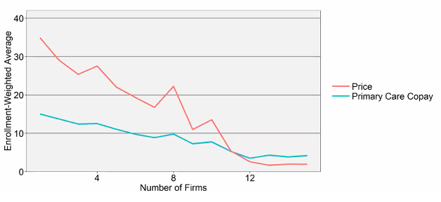
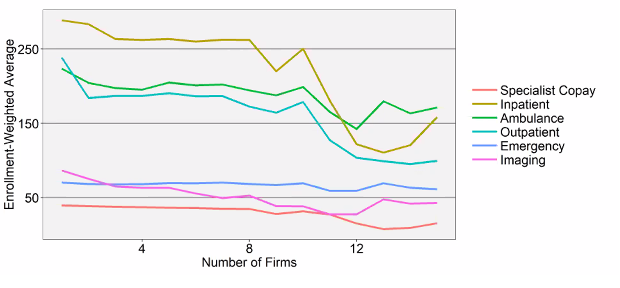
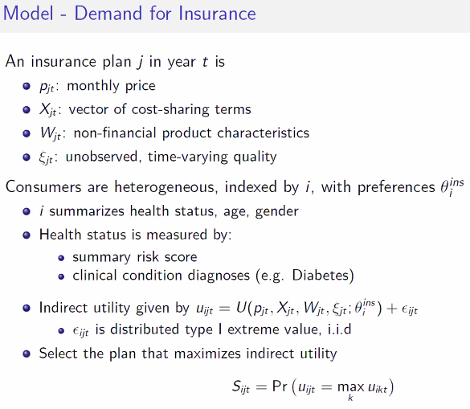

Looks at medicare advantage patients. Sees prices billed to insurance and what the patient pays.

Price (monthly insurance premium)  and primary care copay are both lower in counties with more firms.

Markets are delineated by county. Gov requires insurance same for eveyone in thar county.

Coinsurance rates don't decline aas drastically for other things like specialist services and the like 

Most of the country is in the 10-or-less category. The ones with more are weird places like new york.

Despite low average payment, a fourth of out of pocket spending is on primary care.

log linear healthcare consumption

Standard demand estimation, but Ryan can observe heterogeneity in terms of specific medical treatments.

Inertia in insurance plans. Most people don't change. So maybe cost-sharing changes to last years's plans are plasubily exogenous.

Statistical value of life seems to to exceed a million bucks, even for people over 80 (Aldy, Viscussi, 2007)

Mergers with primary care copay going down lead to welfare going up.

---

Sam Bailey Talked about Ports deciding to become Big Ship Ready

Governments subsidize the expansion of ports to accomodate big ol' ships

Crew size doesn't increase with ship size
fuel costs increase less than linearly with ship volume.
Economies of scale if ports can act as cartels.

